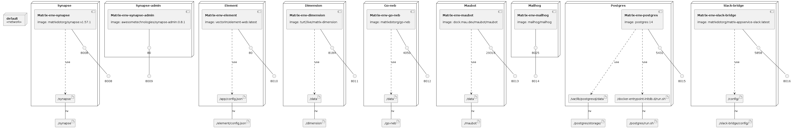

# matrix-env
This project provides a self-contained [Matrix.org](https://matrix.org) sandbox, using [Docker Compose](https://docs.docker.com/compose). It allows you to quickly get a Matrix _node_ running on your local machine, for exploration or hacking on the Matrix ecosystem.

It gives you the following pre-configured services:

| Service  | Description | URL |
| ------------- | ------------- | ------------- |
| [synapse](https://github.com/matrix-org/synapse) | The reference homeserver implementation | [localhost:8008](http://localhost:8008) |
| [synapse-admin](https://github.com/Awesome-Technologies/synapse-admin) | Homeserver admin UI | [localhost:8009](http://localhost:8009) |
| [element](https://github.com/vector-im/element-web) | Web-based Matrix client | [localhost:8010](http://localhost:8010) |
| [dimension](https://dimension.t2bot.io/) | Integration manager | [localhost:8011](http://localhost:8011) |
| [go-neb](https://github.com/matrix-org/go-neb) | Extensible bot, written in Go | [localhost:8012](http://localhost:8012) |
| [maubot](https://github.com/maubot/maubot) | Extensible bot, written in Python | [localhost:8013](http://localhost:8013) |
| [mailhog](https://github.com/mailhog/MailHog) | Mock SMTP server for catching sent emails | [localhost:8014](http://localhost:8014) |
| [postgres](https://www.postgresql.org) | PostgreSQL database service | [localhost:8015](http://localhost:8015) |
| [slack-bridge](https://github.com/matrix-org/matrix-appservice-slack) | Bridge that replicates conversation between Slack and Matrix | [localhost:8016](http://localhost:8016) |

## Instructions
Create the `.env.local` file, which you can use to override environment variables defined in `.env`, if you so wish:

```shell
echo "# Environment variables defined in this file override the ones defined in .env" > .env.local
```

Create the `network`:

```shell
docker network create matrix-env
```

Then start everything with:

```shell
docker compose up
```

> You might notice Dimension exits with an error. This is expected, since Dimension requires [further configuration](dimension.md) to properly boot. However, if you don't plan on using Dimension, you can safely ignore this error.

> You will also notice `slack-bridge` exits with an error, that it couldn't establish connection with PostgreSQL database service. Simply start it again, it will work just fine. This happens because, even though the slack-bridge container starts after the PostgreSQL container, PostgreSQL isn't ready to accept connections by the time the slack-bridge attempts to do so.

## Creating users
You can use [bin/register_new_matrix_user](bin/register_new_matrix_user) to create users from the command line:

```shell
# Create a privileged user with username 'admin' and password 'admin'.
# Add --help to see documentation.

bin/register_new_matrix_user -u admin -p admin --admin
```

## Catching sent emails
Emails sent by any of the provided services are _caught_ by Mailhog, and made available through a Web UI, available at http://localhost:8014.

## Database access
Each service uses its own SQLite database. To access each database, simply open the file with an SQLite client. The files are stored under:

- synapse: `synapse/data/homeserver.db`
- dimension: `dimension/dimension.db`
- maubot: `maubot/maubot.db`
- go-neb: `go-neb/go-neb.db`

### PostgreSQL database files
PostgreSQL database is stored as files under `postgres/storage/`. Currently only `slack-bridge` uses PostgreSQL to store data.
You can also directly connect to the database `slack_bridge` running on port `8015` by user `postgres` and password `postgres`. Connection string: `postgresql://localhost/slack_bridge?user=postgres&password=postgres`

## Credentials

- Matrix users
    - admin:
        - username: `admin`
        - password: `admin`
    - dimension:
        - username: `dimension`
        - password: `dimension`
- maubot
    - username: `admin`
    - password: `admin`
- PostgreSQL
    - username: `postgres`
    - password: `postgres`

## Starting from scratch
Use the following commands to remove all containers and all data:

```shell
docker compose down
rm synapse/data/homeserver.db dimension/dimension.db maubot/maubot.db go-neb/go-neb.db
rm -r postgres/storage
```

Also note that Element stores data in the browser's local storage. To really start from scratch, you must also delete all browser data related to http://localhost:8010.


### Infrastructure model

